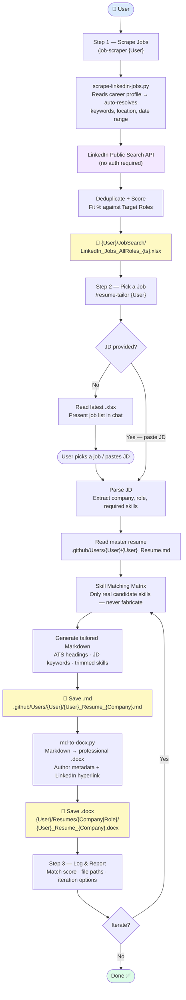
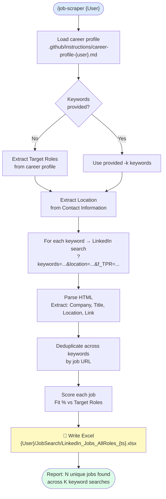
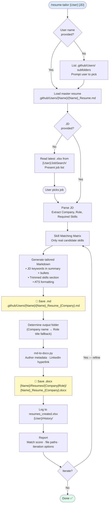

# Resume Workspace

AI-assisted job-hunt pipeline — scrape LinkedIn jobs, tailor resumes to JDs, export ATS-friendly `.docx` files.
Works with **GitHub Copilot**, **Claude Code**, **Cursor**, **OpenAI Codex agents**, and standalone Python scripts.

---

## AI Assistant Compatibility

| Coding Assistant | Config File | Format |
|---|---|---|
| GitHub Copilot | `.github/copilot-instructions.md` + `.github/skills/` | Instructions + Skills |
| Claude Code | `CLAUDE.md` + `.claude/` | Markdown + Claude commands |
| OpenAI Codex / agents | `AGENTS.md` | Markdown rules |
| Any assistant | `README.md` | Universal docs |

---

## Prerequisites

| Requirement | Version |
|---|---|
| Python | 3.10+ |
| pip | bundled with Python |
| *(optional)* GitHub Copilot Chat | Latest (agent mode, VS Code) |
| *(optional)* Claude Code | Latest (`claude` CLI) |

---

## Setup

### 1. Create and activate the virtual environment

The venv is named **`resume_assistant`**.

**Windows (PowerShell):**
```powershell
python -m venv resume_assistant
.\resume_assistant\Scripts\Activate.ps1
```

**Windows (cmd):**
```cmd
python -m venv resume_assistant
resume_assistant\Scripts\activate.bat
```

**macOS / Linux (bash):**
```bash
python3 -m venv resume_assistant
source resume_assistant/bin/activate
```

### 2. Install dependencies

```bash
pip install -r requirements.txt
```

Dependencies installed:

| Package | Purpose |
|---------|---------|
| `python-docx` | Generate `.docx` resume files |
| `markitdown[docx,pdf]` | Extract text from `.docx`/`.pdf` resumes |
| `requests` | HTTP calls to LinkedIn guest search |
| `beautifulsoup4` | Parse LinkedIn HTML job listings |
| `openpyxl` | Read/write Excel job tracking files |

### 3. Bootstrap user directories from `.docx` files

Place `{Name}_Resume.docx` files in the **project root**, then run:

```bash
python setup-users.py                 # process all *_Resume.docx in root
python setup-users.py Pravin Navya    # specific users only
```

This script:
- Extracts Markdown from each `.docx` using `markitdown`
- Writes/updates `.github/Users/{Name}/{Name}_Resume.md` and `.claude/Users/{Name}/{Name}_Resume.md`
- Creates output folders: `{Name}/Resumes/`, `{Name}/JobSearch/archive/`, `{Name}/History/`
- **Safe to re-run** — updates existing files, creates missing ones

> `setup-users.py` reuses extraction logic from `extract-resume.py` (DRY via `importlib`).

### 5. Add your career profile

Copy the template and fill in your details (this file is gitignored — it contains PII):

**Windows (PowerShell):**
```powershell
Copy-Item ".github\instructions\career-profile-template.instructions.md" `
  ".github\instructions\career-profile-{YourName}.instructions.md"

# Also mirror for Claude Code
Copy-Item ".claude\instructions\career-profile-template.instructions.md" `
  ".claude\instructions\career-profile-{YourName}.instructions.md"
```

**Windows (cmd):**
```cmd
copy ".github\instructions\career-profile-template.instructions.md" ^
  ".github\instructions\career-profile-{YourName}.instructions.md"

REM Also mirror for Claude Code
copy ".claude\instructions\career-profile-template.instructions.md" ^
  ".claude\instructions\career-profile-{YourName}.instructions.md"
```

**macOS / Linux (bash):**
```bash
cp .github/instructions/career-profile-template.instructions.md \
  .github/instructions/career-profile-{YourName}.instructions.md

# Also mirror for Claude Code
cp .claude/instructions/career-profile-template.instructions.md \
  .claude/instructions/career-profile-{YourName}.instructions.md
```

Fill in: `{Full Name}`, `{Email}`, `{Phone}`, `{LinkedIn}`, `{Location}`, `Target Roles`, `Target Industries`.

### 6. Add your master resume

Place your full resume (all skills, full history) at:

```text
.github/Users/{YourName}/{YourName}_Resume.md
```

Use the template at `.github/skills/resume-tailor/assets/template-markdown.md` as a starting point, or run the extract script on an existing `.docx`/`.pdf`:

**Windows (PowerShell):**
```powershell
python .github\skills\resume-tailor\scripts\extract-resume.py `
  "path\to\Resume.docx" -o ".github\Users\{YourName}\{YourName}_Resume.md"
```

**Windows (cmd):**
```cmd
python .github\skills\resume-tailor\scripts\extract-resume.py ^
  "path\to\Resume.docx" -o ".github\Users\{YourName}\{YourName}_Resume.md"
```

**macOS / Linux (bash):**
```bash
python .github/skills/resume-tailor/scripts/extract-resume.py \
  "path/to/Resume.docx" -o ".github/Users/{YourName}/{YourName}_Resume.md"
```

---

## Project Structure

```text
resume-workspace/
│
├── CLAUDE.md                                  # Claude Code entry point (full developer guide)
├── AGENTS.md                                  # OpenAI agents behaviour rules
├── requirements.txt                           # Python dependencies (pip install -r requirements.txt)
│
├── .github/                                   # GitHub Copilot configuration
│   ├── copilot-instructions.md                # Global Copilot context (auto-loaded)
│   ├── instructions/                          # Career profiles — GITIGNORED (PII, add locally)
│   │   └── career-profile-template.instructions.md  # Starter template
│   │
│   ├── skills/
│   │   ├── job-scraper/
│   │   │   ├── SKILL.md                       # Copilot skill definition
│   │   │   └── scripts/
│   │   │       └── scrape-linkedin-jobs.py    # LinkedIn scraper
│   │   │
│   │   └── resume-tailor/
│   │       ├── SKILL.md                       # Copilot skill definition
│   │       ├── assets/
│   │       │   ├── template-markdown.md       # Resume Markdown template
│   │       │   └── template-latex.tex         # Resume LaTeX template
│   │       ├── references/
│   │       │   └── ats-guidelines.md          # ATS formatting rules
│   │       └── scripts/
│   │           ├── md-to-docx.py              # Markdown → .docx converter
│   │           ├── extract-resume.py          # .docx/.pdf → Markdown extractor
│   │           ├── tailor-resume.py           # Deterministic keyword-match tailoring
│   │           ├── batch-pipeline.py          # Autonomous batch orchestrator
│   │           ├── batch-job-reader.py        # Excel → JSON manifest generator
│   │           └── log-application.py         # Append row to resumes_created.xlsx
│   │
│   ├── Users/                                 # Master resumes — GITIGNORED (PII, add locally)
│   │   └── ExampleUser/                       # Template user folder (committed)
│   │
│   ├── agents/
│   │   └── job-search.agent.md                # Full pipeline agent
│   │
│   ├── prompts/                               # Slash-command autocomplete prompts
│   │   ├── job-scraper.prompt.md
│   │   └── resume-tailor.prompt.md
│   │
│   └── context/                               # Developer notes
│       ├── job_scraper.md
│       └── resume_tailor.md
│
├── .claude/                                   # Claude Code configuration (mirrors .github/)
│   └── (same structure as .github/)
│
├── docs/
│   ├── architecture.mmd                       # Mermaid flowchart source
│   └── resume_tailor.png                      # Architecture diagram
│
├── {UserName}/                                # Per-user output — GITIGNORED content
│   ├── JobSearch/                             # Scraped job listings + batch manifests
│   │   └── archive/                           # Previous searches
│   ├── Resumes/                               # Tailored .docx resumes
│   │   └── {Company}/
│   └── History/
│       └── resumes_created.xlsx               # Application tracker
│
└── .venv/                                     # Python virtual environment (gitignored)
```

---

## End-to-End Workflow



---

## Skills

### Job Scraper

Scrapes public LinkedIn job listings and produces a timestamped Excel file rated against your career profile target roles.

**Invoke via Copilot Chat:**

```text
/job-scraper Pravin
/job-scraper Navya
```

**Or run directly:**

**Windows (PowerShell):**
```powershell
# All target roles from career profile (default — past 24 hours)
python .github\skills\job-scraper\scripts\scrape-linkedin-jobs.py --user Pravin

# Specific keyword, location, time window, result limit
python .github\skills\job-scraper\scripts\scrape-linkedin-jobs.py `
  -k "Data Analyst" -l "Dublin, Ireland" -d week -m 50 --user Pravin

# Multiple explicit keywords
python .github\skills\job-scraper\scripts\scrape-linkedin-jobs.py `
  -k "DevOps" -k "SRE" -k "Platform Engineer" --user Pravin
```

**Windows (cmd):**
```cmd
REM All target roles from career profile (default — past 24 hours)
python .github\skills\job-scraper\scripts\scrape-linkedin-jobs.py --user Pravin

REM Specific keyword, location, time window, result limit
python .github\skills\job-scraper\scripts\scrape-linkedin-jobs.py ^
  -k "Data Analyst" -l "Dublin, Ireland" -d week -m 50 --user Pravin

REM Multiple explicit keywords
python .github\skills\job-scraper\scripts\scrape-linkedin-jobs.py ^
  -k "DevOps" -k "SRE" -k "Platform Engineer" --user Pravin
```

**macOS / Linux (bash):**
```bash
# All target roles from career profile (default — past 24 hours)
python .github/skills/job-scraper/scripts/scrape-linkedin-jobs.py --user Pravin

# Specific keyword, location, time window, result limit
python .github/skills/job-scraper/scripts/scrape-linkedin-jobs.py \
  -k "Data Analyst" -l "Dublin, Ireland" -d week -m 50 --user Pravin

# Multiple explicit keywords
python .github/skills/job-scraper/scripts/scrape-linkedin-jobs.py \
  -k "DevOps" -k "SRE" -k "Platform Engineer" --user Pravin
```

**CLI arguments:**

| Argument | Default | Description |
|----------|---------|-------------|
| `-u / --user` | `Pravin` | User name — resolves career profile and output folder |
| `-k / --keyword` | *(from profile)* | Job keyword; repeat for multiple |
| `-l / --location` | *(from profile)* | Location filter |
| `-d / --date-posted` | `day` | `day`, `week`, or `month` |
| `-m / --max-results` | `25` | Max results per keyword |
| `-o / --output` | `{User}/JobSearch` | Output folder override |

**Output:** `{User}/JobSearch/LinkedIn_Jobs_AllRoles_{YYYYMMDD_HHMM}.xlsx`

Excel columns: `#`, `Company`, `Job Title`, `Location`, `Job Link`, `Date Scraped`, `Fit %`, `Best Matching Role`

---

#### Job Scraper Flow



---

### Resume Tailor

Tailors a master resume to a specific job description. Produces an ATS-optimised Markdown file and a formatted `.docx`. Never fabricates skills or experience.

**Invoke via Copilot Chat:**

```text
# With JD pasted inline
/resume-tailor Pravin <paste full job description here>

# Name only — agent reads latest job scrape and presents a list to pick from
/resume-tailor Pravin
```

**Convert a `.docx`/`.pdf` to Markdown (onboarding a new resume):**

**Windows (PowerShell):**
```powershell
python .github\skills\resume-tailor\scripts\extract-resume.py `
  "path\to\Resume.docx" -o ".github\Users\Pravin\Pravin_Resume.md"
```

**Windows (cmd):**
```cmd
python .github\skills\resume-tailor\scripts\extract-resume.py ^
  "path\to\Resume.docx" -o ".github\Users\Pravin\Pravin_Resume.md"
```

**macOS / Linux (bash):**
```bash
python .github/skills/resume-tailor/scripts/extract-resume.py \
  "path/to/Resume.docx" -o ".github/Users/Pravin/Pravin_Resume.md"
```

**Generate `.docx` from Markdown manually:**

**Windows (PowerShell):**
```powershell
python .github\skills\resume-tailor\scripts\md-to-docx.py `
  ".github\Users\Pravin\Pravin_Resume_Acme.md" "Pravin\Resumes\Acme" "Pravin Kumar Durairaj"
```

**Windows (cmd):**
```cmd
python .github\skills\resume-tailor\scripts\md-to-docx.py ^
  ".github\Users\Pravin\Pravin_Resume_Acme.md" "Pravin\Resumes\Acme" "Pravin Kumar Durairaj"
```

**macOS / Linux (bash):**
```bash
python .github/skills/resume-tailor/scripts/md-to-docx.py \
  ".github/Users/Pravin/Pravin_Resume_Acme.md" "Pravin/Resumes/Acme" "Pravin Kumar Durairaj"
```

**ATS Rules enforced automatically:**

- Standard section headings in this order: `Professional Summary` → `Skills` → `Work Experience` → `Education` → `Projects` → `Certifications` → `Right to Work`
- No tables, text boxes, columns, or graphics
- No headers/footers — contact info in body text
- Date format: `MMM YYYY` (e.g. `Jan 2023`)
- No first-person pronouns
- **Pravin: strict max 2 pages** — current role (Murex) must fit within page 1 (max 10 bullets)
- **Navya: max 3 pages**
- Right to Work line is mandatory for Irish employers
- Projects appear **after** Education — omitted entirely if zero JD-relevant projects or page limit exceeded
- `"kubernetes"` never appears in Professional Summary

---

#### Resume Tailor Flow



---

## Autonomous Batch Pipeline

Process an entire job manifest without LLM approvals (~95% fewer tokens than manual batch):

**Windows (PowerShell):**
```powershell
# Step 1: Generate manifest from latest scraped Excel
python .github\skills\resume-tailor\scripts\batch-job-reader.py --user Pravin --min-fit 50

# Step 2: Tailor all jobs autonomously (output: .docx per job, context .md, log entry)
python .github\skills\resume-tailor\scripts\batch-pipeline.py `
  --manifest Pravin\JobSearch\batch_manifest_{ts}.json `
  --min-fit 50 --llm-polish-above 75
```

**Windows (cmd):**
```cmd
REM Step 1: Generate manifest from latest scraped Excel
python .github\skills\resume-tailor\scripts\batch-job-reader.py --user Pravin --min-fit 50

REM Step 2: Tailor all jobs autonomously (output: .docx per job, context .md, log entry)
python .github\skills\resume-tailor\scripts\batch-pipeline.py ^
  --manifest Pravin\JobSearch\batch_manifest_{ts}.json ^
  --min-fit 50 --llm-polish-above 75
```

**macOS / Linux (bash):**
```bash
# Step 1: Generate manifest from latest scraped Excel
python .github/skills/resume-tailor/scripts/batch-job-reader.py --user Pravin --min-fit 50

# Step 2: Tailor all jobs autonomously (output: .docx per job, context .md, log entry)
python .github/skills/resume-tailor/scripts/batch-pipeline.py \
  --manifest Pravin/JobSearch/batch_manifest_{ts}.json \
  --min-fit 50 --llm-polish-above 75
```

**batch-pipeline.py arguments:**

| Argument | Default | Description |
|----------|---------|-------------|
| `--manifest` | *(required)* | Path to manifest JSON |
| `--min-fit` | `0` | Skip jobs below this fit % |
| `--max-bullets` | `10` | Max bullets for current role (Murex) |
| `--max-older-bullets` | `4` | Max bullets for older roles |
| `--max-projects` | `2` | Max projects (only if JD-relevant) |
| `--dry-run` | — | Print plan, no files generated |

Each job: keyword-match bullets → filter skills → write `.docx` directly → context `.md` → log to `resumes_created.xlsx`

**tailor-resume.py** (single job, called internally by batch-pipeline):

**Windows (PowerShell):**
```powershell
python .github\skills\resume-tailor\scripts\tailor-resume.py `
  --user Pravin --company "Acme Corp" --role "Senior Data Analyst" `
  --jd "path\to\jd.txt" --fit 82
```

**Windows (cmd):**
```cmd
python .github\skills\resume-tailor\scripts\tailor-resume.py ^
  --user Pravin --company "Acme Corp" --role "Senior Data Analyst" ^
  --jd "path\to\jd.txt" --fit 82
```

**macOS / Linux (bash):**
```bash
python .github/skills/resume-tailor/scripts/tailor-resume.py \
  --user Pravin --company "Acme Corp" --role "Senior Data Analyst" \
  --jd "path/to/jd.txt" --fit 82
```

---

## Available Users

| User | Career Profile | Master Resume | Output Folder |
|------|---------------|---------------|---------------|
| `Pravin` | `career-profile-pravin.instructions.md` | `Pravin_Resume.md` | `Pravin/` |
| `Navya` | `career-profile-navya.instructions.md` | `Navya_Resume.md` | `Navya/` |

### Adding a new user

1. Place `{Name}_Resume.docx` in the **project root**
2. Run `python setup-users.py {Name}` — this creates all directories and extracts the resume Markdown
3. Create `.github/instructions/career-profile-{Name}.instructions.md` (copy the template and fill in your details)
4. Mirror career profile to `.claude/instructions/career-profile-{Name}.instructions.md`
5. The user is immediately available as `--user {Name}` for both skills

---

## Output Files Reference

| File / Folder | Created by | Description |
|---------------|-----------|-------------|
| `{User}/JobSearch/LinkedIn_Jobs_AllRoles_{ts}.xlsx` | job-scraper | Scraped job listings with fit scores |
| `{User}/JobSearch/batch_manifest_{ts}.json` | batch-job-reader | Batch input for autonomous pipeline |
| `{User}/JobSearch/batch_results.json` | batch-pipeline | Per-run summary (jobs processed, skipped, errors) |
| `{User}/JobSearch/archive/` | Manual / job-scraper | Previous job search results |
| `.github/Users/{User}/companies/{Company}.md` | tailor-resume | Per-job context: JD + keyword match report |
| `{User}/Resumes/{Company}/{User}_Resume_{Company}.docx` | tailor-resume / batch-pipeline | Final formatted Word document |
| `{User}/History/resumes_created.xlsx` | log-application | Log of all tailored applications |

---

## Claude Code Usage Guide

This workspace is optimised for Claude Code. Key workflows:

### Effective Prompts

```text
# Tailor a single resume
/resume-tailor Pravin <paste full job description>

# Batch process all jobs ≥75% fit
/resume-tailor auto-batch Pravin --min-fit 75

# Scrape today's jobs
/job-scraper Pravin

# Full pipeline: scrape → batch → log
@job-search-agent Pravin full
```

### Working with Claude Code

- **Explore → Plan → Implement**: for any change touching multiple scripts, start in Plan Mode
- **Verify outputs**: always check that `.md` and `.docx` files were created before marking complete
- **Context management**: run `/clear` between unrelated tasks (e.g., after scraping, before tailoring)
- **Subagents**: delegate codebase investigations to subagents to protect main context window

### CLAUDE.md Best Practices Applied

Following [Claude Code best practices](https://code.claude.com/docs/en/best-practices):

| Practice | Applied How |
|----------|------------|
| Short CLAUDE.md | Only ATS rules + commands; full docs here in README |
| Skills with SKILL.md | `.claude/skills/*/SKILL.md` — invoked via `/skill-name` |
| Agents | `.claude/agents/job-search.agent.md` — full pipeline |
| Context files | `.github/context/` and `.claude/context/` — updated each session |
| Hooks | Add via `.claude/settings.json` for deterministic actions |
| Verification | Scripts output clear success/failure; check output files |
